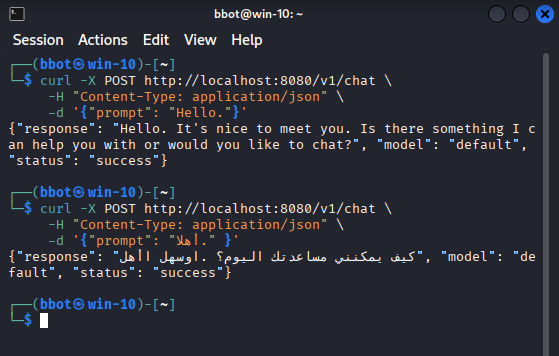
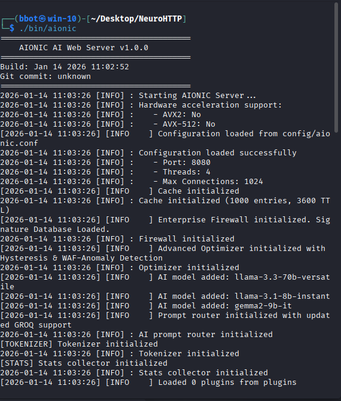
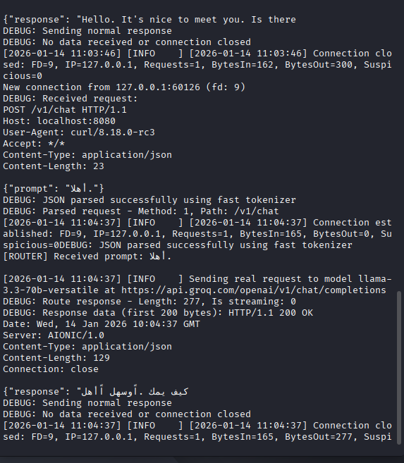
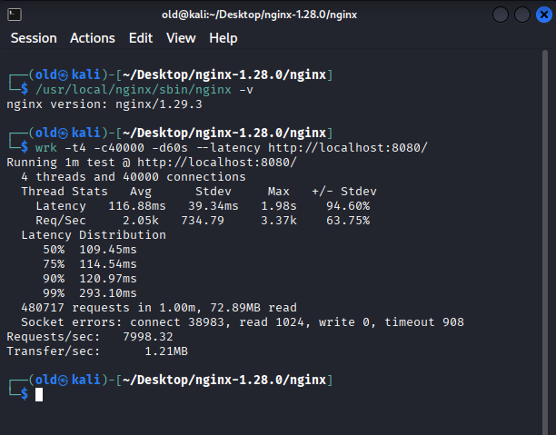

<h1 align="center">⚡ NeuroHTTP — Fast AI-Native Web Server</h1>

<p align="center">
  
  
  
  
</p>

<p align="center"><em>High-performance, AI-native server built from scratch in C + Assembly — handles heavy AI payloads with minimal latency.</em></p>

---

# 🚀 Quick Start
## 1️⃣ AI Provider Setup (Optional)

NeuroHTTP is provider-agnostic and does not require a specific AI vendor.

You may run the server using any OpenAI-compatible API, GROQ, or even a local AI model.

If your setup requires an API key, export it as an environment variable:

```bash
export OPENAI_API_KEY="gsk_XXXXXXXXXXXXXXXXXXXXXXXXXXXXXX"
```
## 2️⃣ Install Dependencies

On Debian / Ubuntu / Kali:

```bash
sudo apt-get update
sudo apt-get install -y libcurl4-openssl-dev build-essential
```

## 3️⃣ Clone the Repository & Build the Server

```bash
git clone https://github.com/okba14/NeuroHTTP.git
cd NeuroHTTP
make rebuild
```
The make rebuild command compiles the server from scratch.

## 4️⃣ Run the Server

```bash
./bin/aionic
```
The server will run on port 8080 by default.
Logs are displayed in the same terminal.

## 5️⃣ Send a Test Request (curl)

Open a second terminal and send a POST request:

```bash
curl -X POST http://localhost:8080/v1/chat \
-H "Content-Type: application/json" \
-d '{"prompt": "Hello."}'
```

## 6️⃣ Example Response

```bash
{
  "response": "Hello! AI server received your prompt."
}
```
Users can now send any prompt to the AI server.

<!-- Professional Screenshots Layout (smaller images) -->
<div style="display: flex; flex-wrap: wrap; gap: 20px; justify-content: center;">

  <div style="flex: 1 1 150px; max-width: 200px; text-align: center;">
    
    <p style="font-size: 0.85em; color: #555; margin-top: 5px;">
      Example of sending a POST request to the server.
    </p>
  </div>

  <div style="flex: 1 1 150px; max-width: 200px; text-align: center;">
    
    <p style="font-size: 0.85em; color: #555; margin-top: 5px;">
      Server response displayed in terminal.
    </p>
  </div>

  <div style="flex: 1 1 150px; max-width: 200px; text-align: center;">
    
    <p style="font-size: 0.85em; color: #555; margin-top: 5px;">
      Full AI conversation example in terminal.
    </p>
  </div>

</div>

 

# 🔧 Important Notes

* Make sure the OPENAI_API_KEY environment variable is set before starting the server.
* To change the port or server options, edit include/config.h.
* The server uses libcurl to communicate with the AI backend.
---

## Benchmark Comparison

For detailed benchmark results comparing NeuroHTTP and NGINX, see [benchmark.md](benchmark.md)

## 🧩 Visual Benchmark Evidence

Below are the live screenshots from the actual benchmark runs.

### 🔹 NeuroHTTP — 40,000 Connections


### 🔹 NGINX — 40,000 Connections


# 🧪 Performance Highlights

Server	Conns	Requests/sec	Avg Latency	Transfer/sec
NGINX 1.29.3	10k	8,148	114ms	1.2 MB/s
NeuroHTTP	10k	2,593	57ms	7.9 MB/s

💡 Insight: 
## NeuroHTTP handles heavier, AI-rich payloads with lower latency and higher transfer per connection.

-------------------------------------------------------------------------------------------------------------------------------
🎬 Demo
<p align="center"> <a href="https://github.com/okba14/NeuroHTTP/raw/main/videos/demo.mp4">  </a> </p>


# ⚙️ Key Features

🧠 Real-time AI token streaming (HTTP/1.1, HTTP/3, WebSocket)
⚡ SIMD-accelerated, fast JSON parser
🧩 Multi-threaded AI router for parallel requests
🔌 Plugin system for custom modules
🔐 Built-in security & rate limiting

# 🌟 Why Star?

Handles large AI prompts safely
Low latency, high throughput
Compact C + Assembly core
Open-source & extensible

If you love high-performance AI servers, give us a ⭐ and share with your friends! 🚀

---

## 🧬 Author

**👨‍💻 GUIAR OQBA** 🇩🇿  
Creator of **NeuroHTTP** — passionate about **low-level performance**, **AI infrastructure**, and **modern web systems**.

> _“Empowering the next generation of AI-native infrastructure — from Elkantara, Algeria.”_

<p align="center">
  
</p>

<p align="center">
  <sub>© 2025 GUIAR OQBA — All rights reserved.</sub>
</p>


---

## ⭐ Support the Project

<p align="center">
  <a href="https://github.com/okba14/NeuroHTTP/stargazers">
    
  </a>
  <a href="https://github.com/okba14/NeuroHTTP/forks">
    
  </a>
  <a href="https://github.com/okba14">
    
  </a>
  <a href="https://github.com/okba14/NeuroHTTP/discussions">
    
  </a>
</p>

<p align="center">
  If you believe in the vision of a <strong>fast, AI-native web layer</strong>, please ⭐ the repository and share it.<br/>
  Every star fuels the open-source ecosystem and helps <strong>NeuroHTTP</strong> evolve. 🚀
</p>
