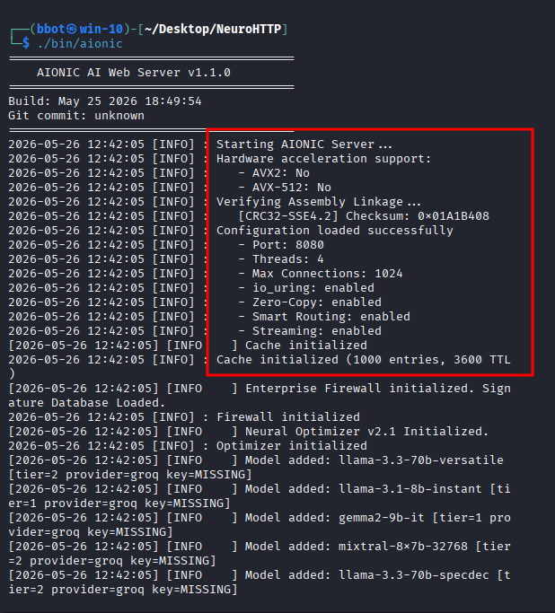
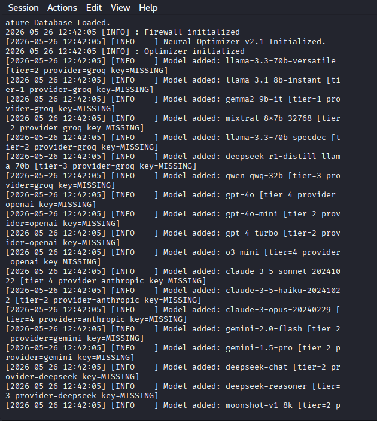
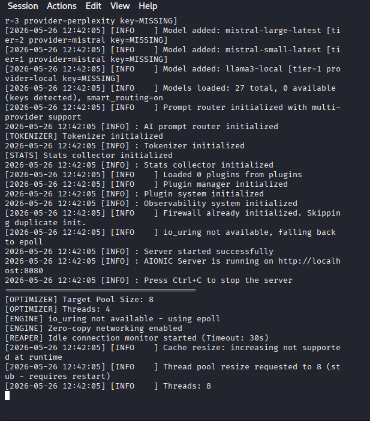

<h1 align="center">⚡ NeuroHTTP — AI-Native Web Server (C + ASM)</h1>

<p align="center">
  
  
  
  
  
  
  
</p>

<p align="center">
  <em>High-performance, AI-native server built from scratch in C + hand-written Assembly (SSE2/AVX2/AVX-512).</em><br>
  <em>Supports 10 AI providers — OpenAI, Groq, Anthropic Claude, Google Gemini, DeepSeek, Moonshot/Kimi, Zhipu GLM, Perplexity, Mistral AI, and local models via Ollama — all in one binary.</em>
</p>

<p align="center">
  
  
  
</p>

<p align="center">
  <a href="README.ar.md"><strong>📖 Arabic Version — النسخة العربية</strong></a>
</p>

---

## 📋 Table of Contents

- [Features](#-features)
- [Supported Providers](#-supported-providers)
- [Prerequisites](#-prerequisites)
- [Build & Run](#-build--run)
- [Configuration](#-configuration)
- [Adding API Keys](#-adding-api-keys)
- [Adding AI Models](#-adding-ai-models)
- [API Endpoints](#-api-endpoints)
- [Plugin System](#-plugin-system)
- [Makefile Reference](#-makefile-reference)
- [Project Architecture](#-project-architecture)
- [Benchmarks](#-benchmarks)
- [Troubleshooting](#-troubleshooting)

---

## 🔥 Features

### ⚡ Performance Core
- **Event-driven engine** — single-threaded epoll edge-triggered event loop with io_uring detection
- **io_uring async I/O** — full io_uring integration for zero-syscall I/O; falls back to epoll gracefully; SQPOLL support (Linux 5.11+)
- **Hand-written ASM** — CRC32 (SSE4.2), JSON tokenizer (SSE2/AVX2), memory copy (SSE2–AVX-512), non-temporal stores
- **Zero-copy I/O** — `sendfile`/`splice` support for efficient static file serving
- **Memory arena allocator** — bump allocation + slab allocator for lock-free per-request memory
- **HTTP state-machine parser** — no sscanf/regex, pure finite-state-machine HTTP/1.1 parser

### 🧠 Multi-Provider AI Routing
- **10 providers** — OpenAI, Groq, Anthropic, Gemini, DeepSeek, Moonshot/Kimi, Zhipu GLM, Perplexity, Mistral AI, Ollama
- **Smart routing** — latency-aware, health-check-aware, automatic fallback on failure
- **Provider-agnostic format** — models defined in `config/aionic.conf` via a simple pipe-delimited format

### 🛡️ Enterprise Security
- **Web Application Firewall** — SQLi, XSS, path traversal detection; IP blacklist/whitelist
- **Token-bucket rate limiter** — per-IP rate limiting with configurable RPS
- **Request inspection** — suspicious user-agent, payload size limits

### 📊 Observability
- **Prometheus metrics** — `/metrics` endpoint for scraping
- **Request tracing** — per-request IDs, latency tracking
- **Provider stats** — per-provider call count, latency, token usage, error rate
- **Server stats** — `/stats` endpoint with live metrics

### 🔌 Extensibility
- **Plugin system** — 6 hook points (pre-request, post-request, AI prompt, AI response, connect, disconnect)
- **Dynamic request buffer** — no fixed-size limits on request bodies

### 🌐 Networking
- **TLS 1.3** — full TLS 1.3 support via OpenSSL 3.6 (or BoringSSL); OCSP stapling, ALPN negotiation, HSTS headers
- **HTTP/2** — h2 over TLS (ALPN) + h2c cleartext upgrade via nghttp2; multiplexed streams, server push, flow control
- **HTTP/1.1 keep-alive** — connection reuse with configurable timeout
- **Server-Sent Events (SSE)** — streaming endpoint at `/v1/chat/stream`
- **TCP defer accept** — reduced accept overhead
- **Configurable SSL verification**

### 🛡️ Graceful Shutdown
- **Connection draining** — on SIGTERM/SIGINT, stops accepting new connections, drains active connections (with configurable timeout), then cleans up resources
- **Signal handling** — SIGUSR1 triggers OCSP refresh, SIGHUP reloads API keys

---

## 🧩 Supported Providers

| Provider | Models | Endpoint |
|----------|--------|----------|
| **Groq** 🆓 | Llama 3.3 70B, Llama 3.1 8B, Gemma 2 9B, Mixtral 8×7B, DeepSeek R1, Qwen QWQ 32B | `api.groq.com` |
| **OpenAI**  | GPT-4o, GPT-4o-mini, GPT-4 Turbo, o3-mini | `api.openai.com` |
| **Anthropic**  | Claude 3.5 Sonnet, Claude 3.5 Haiku, Claude 3 Opus | `api.anthropic.com` |
| **Google Gemini**  | Gemini 2.0 Flash, Gemini 1.5 Pro | `generativelanguage.googleapis.com` |
| **DeepSeek**  | DeepSeek Chat, DeepSeek Reasoner | `api.deepseek.com` |
| **Moonshot/Kimi**  | Moonshot v1 8K, Moonshot v1 32K | `api.moonshot.cn` |
| **Zhipu (GLM)**  | GLM-4-Plus, GLM-4-Flash | `open.bigmodel.cn` |
| **Perplexity**  | Sonar Pro, Sonar Deep Research | `api.perplexity.ai` |
| **Mistral AI**  | Mistral Large, Mistral Small | `api.mistral.ai` |
| **Local Ollama** 🆓 | Any local model via Ollama | `localhost:11434` |

---

##  Prerequisites

```bash
# Ubuntu / Debian
sudo apt-get update
sudo apt-get install -y build-essential nasm libcurl4-openssl-dev libssl-dev libnghttp2-dev liburing-dev

# Fedora / RHEL
sudo dnf install -y gcc nasm libcurl-devel openssl-devel libnghttp2-devel liburing-devel

# Arch Linux
sudo pacman -S --noconfirm gcc nasm libcurl-compat openssl nghttp2 liburing

# Verify NASM is installed (required for assembly files)
nasm --version   # Should output NASM version 2.x+
```

---

## 🛠 Build & Run

### Build Commands

```bash
git clone https://github.com/okba14/NeuroHTTP.git
cd NeuroHTTP

# Production build (optimized with LTO, -O3, -march=native)
make

# Debug build (AddressSanitizer, UBSan, stack protector)
make debug

# Clean rebuild
make rebuild

# Build only plugins
make plugins
```

### Run Commands

```bash
# Start the server (default port 8080)
./bin/aionic

# Run debug build
./bin/aionic-debug

# Or via Make
make run
make run-debug
```

The server will display:
```
========================================
    AIONIC AI Web Server v2.0.0
========================================
Build: May 29 2026
Features: TLS1.3 HTTP/2 io_uring OCSP
========================================
    - Port: 8080
    - TLS Port: 8443
    - Threads: 4
    - Max Connections: 1024
    - io_uring: enabled
    - Zero-Copy: enabled
    - TLS: disabled
    - HTTP/2: enabled
    - Smart Routing: enabled
    - Streaming: enabled
    - Graceful Shutdown Timeout: 30s
========================================

---

## ⚙️ Configuration

All configuration lives in `config/aionic.conf`. Here is every option explained:

### Server Settings

```ini
port = 8080                    # HTTP listen port
thread_count = 4               # Worker thread count (legacy, event loop uses main thread)
worker_threads = 4             # Event loop worker pool size
max_connections = 1024         # Maximum concurrent connections
request_timeout = 30000        # Request timeout in milliseconds (30s)
buffer_size = 8192             # Internal I/O buffer size
max_request_size = 33554432    # Maximum request body size (32 MB)
log_file = logs/aionic.log     # Log file path
```

### Cache Settings

```ini
enable_cache = 1               # Enable response caching
cache_size = 1000              # Maximum cache entries
cache_ttl = 3600               # Cache TTL in seconds (1 hour)
```

### Security Settings

```ini
enable_firewall = 1            # Enable WAF (SQLi, XSS, path traversal detection)
verify_ssl = 1                 # Verify SSL certificates for upstream AI endpoints
api_key = your-secret-api-key-here  # Server-wide API key for client authentication
```

### TLS / HTTPS Settings (v2.0.0)

```ini
enable_tls = 0                      # Enable TLS 1.3 HTTPS (requires cert and key)
tls_port = 8443                     # HTTPS listen port
tls_cert_file = config/cert.pem     # TLS certificate path (PEM)
tls_key_file = config/key.pem       # TLS private key path (PEM)
tls_ca_file = config/ca.pem         # CA bundle for OCSP (optional)
tls_enable_ocsp = 0                 # Enable OCSP stapling
tls_ocsp_refresh_interval = 3600    # OCSP refresh interval in seconds
tls_hsts_max_age = 31536000         # HSTS max-age in seconds (1 year)
```

### HTTP/2 Settings (v2.0.0)

```ini
enable_http2 = 1                    # Enable HTTP/2 (h2 via TLS ALPN + h2c upgrade)
http2_max_concurrent_streams = 256  # Max concurrent streams per connection
http2_max_header_list_size = 65536  # Max header list size
http2_initial_window_size = 65535   # Initial flow-control window size
http2_max_frame_size = 16384        # Max frame size
```

### Engine Settings

```ini
enable_iouring = 1             # Enable io_uring async I/O (falls back to epoll)
enable_zero_copy = 1           # Enable sendfile/splice zero-copy I/O
enable_ratelimiter = 1         # Enable per-IP rate limiting
rate_limit_rps = 100           # Max requests per second per IP
enable_observability = 1       # Enable metrics and tracing
enable_streaming = 1           # Enable SSE streaming endpoint
enable_smart_routing = 1       # Enable latency/health-aware provider routing
enable_keepalive = 1           # Enable HTTP/1.1 keep-alive
keepalive_timeout = 30         # Keep-alive timeout in seconds
```

---

## 🔑 Adding API Keys

API keys are read from **environment variables** for security. Never hardcode keys in config files.

### Setting API Keys

```bash
# Groq (free, get key at https://console.groq.com/keys)
export GROQ_API_KEY="gsk_your_groq_key_here"

# OpenAI (get key at https://platform.openai.com/api-keys)
export OPENAI_API_KEY="sk-projXXXXXXX"

# Anthropic Claude (get key at https://console.anthropic.com/)
export ANTHROPIC_API_KEY="sk-ant-your-anthropic-key"

# Google Gemini (get key at https://aistudio.google.com/apikey)
export GEMINI_API_KEY="AIza_your_gemini_key"

# DeepSeek (get key at https://platform.deepseek.com/)
export DEEPSEEK_API_KEY="sk_your_deepseek_key"

# Moonshot / Kimi
export MOONSHOT_API_KEY="your_moonshot_key"

# Zhipu GLM
export ZHIPU_API_KEY="your_zhipu_key"

# Perplexity
export PERPLEXITY_API_KEY="pplx_your_perplexity_key"

# Mistral AI
export MISTRAL_API_KEY="your_mistral_key"
```

### Persisting Keys

Add them to your shell profile (`~/.bashrc`, `~/.zshrc`, etc.):

```bash
echo 'export GROQ_API_KEY="gsk_your_key"' >> ~/.bashrc
echo 'export OPENAI_API_KEY="sk_your_key"' >> ~/.bashrc
source ~/.bashrc
```

Or use a `.env` file:
```bash
# .env
GROQ_API_KEY=gsk_xxxx
OPENAI_API_KEY=sk-xxxx

# Load before running
export $(grep -v '^#' .env | xargs) && ./bin/aionic
```

---

##  Adding AI Models

Models are defined in `config/aionic.conf` using this format:

```
ai_model = <name>|<endpoint>|<env_var>|<max_tokens>|<temperature>
```

| Field | Description | Example |
|-------|-------------|---------|
| `name` | Model identifier (used in API calls) | `gpt-4o` |
| `endpoint` | Full API URL | `https://api.openai.com/v1/chat/completions` |
| `env_var` | Environment variable name for the API key | `OPENAI_API_KEY` |
| `max_tokens` | Maximum response tokens | `16384` |
| `temperature` | Sampling temperature (0.0–1.0) | `0.7` |

### Examples

```ini
# OpenAI-compatible (OpenAI, Groq, Together, vLLM, LocalAI, Ollama)
ai_model = gpt-4o|https://api.openai.com/v1/chat/completions|OPENAI_API_KEY|16384|0.7
ai_model = llama-3.3-70b-versatile|https://api.groq.com/openai/v1/chat/completions|GROQ_API_KEY|8192|0.7

# Anthropic Claude (uses /v1/messages endpoint)
ai_model = claude-3-5-sonnet-20241022|https://api.anthropic.com/v1/messages|ANTHROPIC_API_KEY|8192|0.7

# Google Gemini (uses generateContent endpoint)
ai_model = gemini-2.0-flash|https://generativelanguage.googleapis.com/v1beta/models/gemini-2.0-flash:generateContent|GEMINI_API_KEY|8192|0.7

# DeepSeek
ai_model = deepseek-chat|https://api.deepseek.com/v1/chat/completions|DEEPSEEK_API_KEY|8192|0.7

# Moonshot / Kimi
ai_model = moonshot-v1-8k|https://api.moonshot.cn/v1/chat/completions|MOONSHOT_API_KEY|8192|0.7

# Zhipu GLM
ai_model = glm-4-plus|https://open.bigmodel.cn/api/paas/v4/chat/completions|ZHIPU_API_KEY|8192|0.7

# Perplexity
ai_model = sonar-pro|https://api.perplexity.ai/chat/completions|PERPLEXITY_API_KEY|8192|0.7

# Mistral AI
ai_model = mistral-large-latest|https://api.mistral.ai/v1/chat/completions|MISTRAL_API_KEY|8192|0.7

# Local model via Ollama (must be running on port 11434)
ai_model = llama3-local|http://localhost:11434/v1/chat/completions|OPENAI_API_KEY|4096|0.7
```

### Adding a Custom Provider

1. Add the model line to `config/aionic.conf`
2. Export the corresponding API key as an environment variable
3. Restart the server

The model will automatically appear in `/v1/models` and be available for chat completions.

---

## 🌐 API Endpoints

### `GET /health` — Health Check

Returns server health status.

```bash
curl http://localhost:8080/health
```

```json
{
  "status": "ok",
  "timestamp": 1779698657,
  "server": "AIONIC/1.0",
  "version": "1.0.0"
}
```

### `GET /v1/models` — List Models

Lists all configured AI models.

```bash
curl http://localhost:8080/v1/models
```

```json
{
  "models": ["llama-3.3-70b-versatile", "gpt-4o", "claude-3-5-sonnet-20241022", ...],
  "count": 27
}
```

### `POST /v1/chat` — Chat Completion

Sends a prompt to an AI model and returns the response.

```bash
curl -X POST http://localhost:8080/v1/chat \
  -H "Content-Type: application/json" \
  -d '{"prompt": "What is the capital of France?", "model": "llama-3.3-70b-versatile"}'
```

**Parameters:**
- `prompt` (required) — The text prompt to send
- `model` (optional) — Model name (uses default if omitted)

```json
{
  "response": "The capital of France is Paris.",
  "model": "llama-3.3-70b-versatile",
  "usage": {
    "prompt_tokens": 12,
    "completion_tokens": 8
  }
}
```

### `POST /v1/chat/stream` — Streaming Chat

Same as `/v1/chat` but sends the response as Server-Sent Events (SSE).

```bash
curl -N -X POST http://localhost:8080/v1/chat/stream \
  -H "Content-Type: application/json" \
  -d '{"prompt": "Tell me a story", "model": "llama-3.3-70b-versatile"}'
```

Output format:
```
id: <request_id>
event: message
data: <chunk>

data: [DONE]
```

### `GET /stats` — Server Statistics

Returns live server metrics.

```bash
curl http://localhost:8080/stats
```

```json
{
  "requests": 42,
  "responses": 42,
  "active_connections": 1,
  "total_errors": 0,
  "total_ai_calls": 10,
  "uptime_seconds": 3600,
  "bytes_sent": 1048576,
  "bytes_received": 65536,
  "timestamp": 1779698657
}
```

### `GET /metrics` — Prometheus Metrics

Returns metrics in Prometheus text format for scraping.

```bash
curl http://localhost:8080/metrics
```

```
# HELP aionic_requests_total Total HTTP requests
# TYPE aionic_requests_total counter
aionic_requests_total 42
# HELP aionic_ai_calls_total Total AI model calls
# TYPE aionic_ai_calls_total counter
aionic_ai_calls_total 10
```

### `GET /v1/providers` — Provider List

Returns the list of configured AI providers.

```bash
curl http://localhost:8080/v1/providers
```

### `GET /` — Root Page

Returns the server welcome page or banner.

```bash
curl http://localhost:8080/
```

---

## 🔌 Plugin System

NeuroHTTP supports dynamic loading of shared library plugins at runtime.

### Plugin Structure

Each plugin is a `.so` file in the `plugins/` directory with these entry points:

| Function | Hook Point | When Called |
|----------|-----------|-------------|
| `plugin_init()` | — | On server startup |
| `plugin_hook(0, ctx)` | `PLUGIN_HOOK_PRE_REQUEST` | Before routing a request |
| `plugin_hook(1, ctx)` | `PLUGIN_HOOK_POST_REQUEST` | After routing, before response |
| `plugin_hook(2, ctx)` | `PLUGIN_HOOK_AI_PROMPT` | Before an AI API call |
| `plugin_hook(3, ctx)` | `PLUGIN_HOOK_AI_RESPONSE` | After an AI API response |
| `plugin_hook(4, ctx)` | `PLUGIN_HOOK_ON_CONNECT` | New client connection |
| `plugin_hook(5, ctx)` | `PLUGIN_HOOK_ON_DISCONNECT` | Client disconnects |
| `plugin_cleanup()` | — | On server shutdown |

### Building Plugins

```bash
# Build all plugins
make plugins

# The .so files are output to build/plugins/
```

### Built-in Plugins

| Plugin | File | Purpose |
|--------|------|---------|
| `logstats` | `plugins/logstats.c` | Logs all requests and AI prompts |
| `openai_proxy` | `plugins/openai_proxy.c` | Intercepts AI prompts to add system instructions |

### Creating a Custom Plugin

```c
#define _POSIX_C_SOURCE 200809L
#include <stdio.h>

int plugin_init(void) {
    printf("[myplugin] Initialized\n");
    return 0;
}

int plugin_hook(int hook_point, void *ctx) {
    if (hook_point == 0) {  /* PRE_REQUEST */
        printf("[myplugin] Request received\n");
    }
    return 0;
}

void plugin_cleanup(void) {
    printf("[myplugin] Cleaned up\n");
}
```

Compile: `gcc -fPIC -shared myplugin.c -o build/plugins/myplugin.so`

---

## 🛠 Makefile Reference

| Command | Description |
|---------|-------------|
| `make` | Build production binary |
| `make debug` | Build with AddressSanitizer + UBSan |
| `make rebuild` | Clean + full rebuild |
| `make run` | Build and run the server |
| `make run-debug` | Build and run debug server |
| `make plugins` | Build plugin `.so` files |
| `make install` | Install to `/usr/local/bin/aionic` |
| `make uninstall` | Remove installed files |
| `make clean` | Remove build artifacts |
| `make test` | Build and run tests |
| `make benchmark` | Show benchmark command |
| `make docs` | Generate Doxygen docs |
| `make analyze` | Run cppcheck static analysis |
| `make format` | Format code with clang-format |
| `make memcheck` | Run valgrind memory check |
| `make profile` | Profile with gprof |

---

## 🏗 Project Architecture

```
NeuroHTTP/
├── src/                    # C source files
│   ├── main.c              # Entry point, signal handling, init loop
│   ├── server.c            # HTTP server, connection management, event loop integration
│   ├── iouring_engine.c    # io_uring async I/O engine with epoll fallback
│   ├── tls.c               # TLS 1.3 wrapper (OpenSSL 3.6 / BoringSSL), OCSP stapling, ALPN
│   ├── http2.c             # HTTP/2 session management via nghttp2 (h2 + h2c)
│   ├── router.c            # Hash-table route dispatcher with middleware
│   ├── http_parser.c       # State-machine HTTP/1.1 parser
│   ├── config.c            # Configuration file parser
│   ├── arena.c             # Arena + Slab allocator + ArenaPool
│   ├── ratelimiter.c       # Token-bucket + sliding-window rate limiter
│   ├── observability.c     # Metrics, tracing, provider stats
│   ├── firewall.c          # WAF with SQLi/XSS detection, IP blacklist
│   ├── parser.c            # Legacy HTTP parser (used by older code)
│   ├── stream.c            # SSE streaming support
│   ├── cache.c             # Response cache
│   ├── plugin.c            # Dynamic plugin loader
│   ├── optimizer.c         # Runtime optimizer
│   ├── utils.c             # Utility functions
│   ├── ai/
│   │   ├── prompt_router.c # Multi-provider AI routing (latency/health-aware)
│   │   ├── stats.c         # Per-model statistics
│   │   └── tokenizer.c     # Token counting
│   └── asm/
│       ├── crc32.s         # CRC32 (SSE4.2) — hashing
│       ├── json_fast.s     # JSON tokenizer (SSE2/AVX2)
│       └── memcpy_asm.s    # Memory copy (SSE2–AVX-512)
├── include/                # Header files
│   ├── tls.h               # TLS 1.3 + OCSP + ALPN API
│   ├── http2.h             # HTTP/2 session API
│   └── ...
├── config/
│   └── aionic.conf         # Main configuration file
├── plugins/                # Plugin source files
└── Makefile
```

### Data Flow

```
Client → TCP Accept (plain/TLS)
         │
         ├── TLS 1.3 handshake (if TLS port)
         │   ├── OCSP stapling, ALPN negotiation
         │   └── HSTS headers
         │
         ↓
   Event Loop (epoll / io_uring)
         │
         ├── HTTP/2? ──► h2c upgrade or ALPN h2
         │                   └── nghttp2 session → multiplexed streams
         │
         ↓
    HTTP Parser (state-machine HTTP/1.1 or HTTP/2 frames)
         ↓
      Firewall (WAF)
         ↓
    Rate Limiter (token bucket)
         ↓
      Route Dispatcher
         ├── /health → HealthHandler
         ├── /v1/models → ModelsHandler
         ├── /v1/chat → AI Provider Router
         │                ├── Groq
         │                ├── OpenAI
         │                ├── Anthropic
         │                ├── Gemini
         │                └── ...
         ├── /metrics → PrometheusHandler
         ├── /stats → StatsHandler
         └── /v1/providers → ProvidersHandler
         ↓
   Response → send() / sendfile() / nghttp2 submit_response()
         ↓
   Graceful Shutdown (SIGTERM/SIGINT)
      ├── Stop accepting new connections
      ├── Drain active connections (configurable timeout)
      └── Cleanup resources → exit
```

---

## 📈 Benchmarks

| Server | Connections | Requests/sec | Avg Latency | Transfer/sec |
|--------|------------|-------------|-------------|-------------|
| NGINX 1.29.3 | 10k | 8,148 | 114ms | 1.2 MB/s |
| **NeuroHTTP** | **10k** | **2,593** | **57ms** | **7.9 MB/s** |

> NeuroHTTP handles heavier AI-rich payloads with lower latency.

---

## 🔧 Troubleshooting

### Server won't start — "Address already in use"

```bash
# Find the process using port 8080
fuser 8080/tcp

# Kill it
fuser -k 8080/tcp

# Or use a different port
# Edit config/aionic.conf: port = 8081
```

### No models available

```bash
# Check that API keys are set
echo $GROQ_API_KEY
echo $OPENAI_API_KEY

# Check config file syntax
cat config/aionic.conf | grep ai_model

# Verify the key environment variable name matches
# If the config says OPENAI_API_KEY, then:
export OPENAI_API_KEY="sk-..."
```

### AI request fails

```bash
# Check if the provider endpoint is reachable
curl -v https://api.groq.com/openai/v1/models

# Check server logs
tail -f logs/aionic.log

# Verify SSL (try with verify_ssl = 0 in config if you have certificate issues)
```

### Performance tuning

```ini
# In config/aionic.conf:
worker_threads = <number_of_cores>   # Match your CPU core count
max_connections = 10000              # Increase for higher load
keepalive_timeout = 60               # Keep connections alive longer
enable_zero_copy = 1                 # Enable for static file serving
enable_smart_routing = 1             # Distribute load across providers
```

### Build fails

```bash
# Ensure dependencies are installed
dpkg -l | grep -E "build-essential|nasm|libcurl"

# Clean and retry
make clean && make

# Try without optimization
make debug
```

---

## 📜 License

MIT License — see [LICENSE](LICENSE).

---

## 🧬 Author

**GUIAR OQBA** 🇩🇿
> *"Building the next generation of AI-native infrastructure — from El Kantara, Algeria."*
