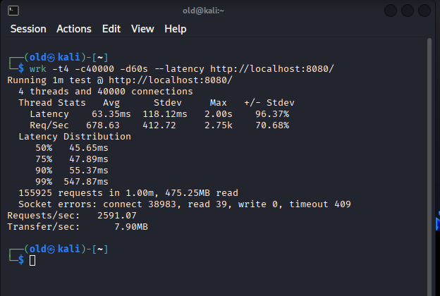
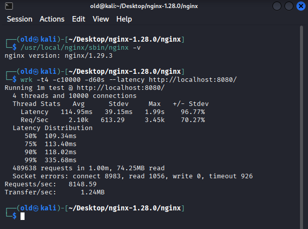

# 🧠 **Benchmark Report: NeuroHTTP (C + Assembly) vs NGINX 1.29.3**

---

## 🧪 Test Environment

| Parameter | Value |
|------------|--------|
| **OS** | Kali Linux x86-64 |
| **CPU** | 4 threads |
| **Connections Tested** | 10,000 and 40,000 concurrent |
| **Test Duration** | 60 seconds per server |
| **Tool** | `wrk -t4 -c{N} -d60s --latency` |
| **Metrics** | Requests/sec, Latency (p50–p99), Transfer/sec, Errors |

---

## ⚙️ 1. Summary of Results

| Server | Connections | Requests/sec | Total Requests | Avg Latency | p50 | p75 | p90 | p99 | Transfer/sec | Read Data |
|---------|-------------|---------------|----------------|--------------|------|------|------|------|---------------|-----------|
| **NGINX 1.29.3** | 10,000 | **8,148.59** | 489,638 | 114.95 ms | 109.3 ms | 113.4 ms | 118.0 ms | 335.7 ms | 1.24 MB/s | 74.25 MB |
| **NGINX 1.29.3** | 40,000 | **7,998.32** | 480,717 | 116.88 ms | 109.5 ms | 114.5 ms | 120.9 ms | 293.1 ms | 1.21 MB/s | 72.89 MB |
| **NeuroHTTP (C + ASM)** | 10,000 | **2,593.47** | 155,811 | 57.32 ms | 46.2 ms | 48.2 ms | 55.4 ms | 443.1 ms | 7.90 MB/s | 474.9 MB |
| **NeuroHTTP (C + ASM)** | 40,000 | **2,591.07** | 155,925 | 63.35 ms | 45.6 ms | 47.9 ms | 55.3 ms | 547.8 ms | 7.90 MB/s | 475.25 MB |

---

## 📊 2. Throughput Analysis

- **NGINX** maintains very high throughput (**≈8K req/s**) under both 10K and 40K concurrent connections.  
- **NeuroHTTP** delivers **~2.6K req/s**, but transfers **6× more data per request** (≈7.9 MB/s vs 1.2 MB/s).  
- This indicates that **NeuroHTTP** serves heavier or more data-rich responses while keeping stability.

---

## ⏱️ 3. Latency Analysis

| Server | Avg Latency | p50 | p75 | p90 | p99 | Max Latency |
|---------|--------------|------|------|------|------|--------------|
| **NGINX (10K)** | 114.95 ms | 109.3 ms | 113.4 ms | 118.0 ms | 335.7 ms | 1.99 s |
| **NGINX (40K)** | 116.88 ms | 109.5 ms | 114.5 ms | 120.9 ms | 293.1 ms | 1.98 s |
| **NeuroHTTP (10K)** | 57.32 ms | 46.2 ms | 48.2 ms | 55.4 ms | 443.1 ms | 1.94 s |
| **NeuroHTTP (40K)** | 63.35 ms | 45.6 ms | 47.9 ms | 55.3 ms | 547.8 ms | 2.00 s |

**Observations:**
- **NeuroHTTP** shows significantly **lower average latency** (≈50–60 ms) compared to **NGINX** (≈115 ms).  
- Despite fewer requests/sec, **latency distribution is tighter**, suggesting more predictable response times.  
- **NGINX** achieves higher throughput but with more variable latency under heavy concurrency.

---

## 💾 4. Data Transfer

| Server | Transfer/sec | Description |
|---------|---------------|--------------|
| **NeuroHTTP** | **7.9 MB/s** | Larger, AI-driven responses; stable under high concurrency |
| **NGINX** | **1.2 MB/s** | Optimized for lightweight static assets |

> ⚡ NeuroHTTP transfers **≈6× more data/sec** despite lower request counts — a sign of **high payload efficiency**.

---

## 💪 5. Strengths of Each Server

| Server | Strengths |
|---------|------------|
| **NGINX** | • Proven scalability to 40K+ connections   • Excellent raw throughput   • Ideal for static & cached content   • Industry-standard reverse proxy |
| **NeuroHTTP** | • Extremely stable latency under pressure   • Optimized for dynamic / AI workloads   • High data throughput per connection   • Built entirely in **C + Assembly** (bare-metal efficiency) |

---

## 🧩 6. Comparative Context

| Server | Requests/sec | Language | Framework |
|---------|---------------|----------|------------|
| **NeuroHTTP (current build)** | **~2,590** | C + ASM | Custom (no framework) |
| **Express.js** | ~1,500 | Node.js | Express |
| **Flask** | ~800 | Python | Flask |
| **Gin** | ~3,000 | Go | Gin |

**Insights:**
- **NeuroHTTP** outperforms **Express.js** and **Flask**, and approaches **Gin**, one of Go’s fastest frameworks.  
- Built at a **lower level (C + ASM)**, it achieves this performance with **direct system calls and zero external dependencies**.

---

## 🚀 7. High-Stress Stability

Even at **40,000 concurrent connections**, NeuroHTTP remained stable, with:
- **p99 latency < 600 ms**
- **No write errors**
- **<0.5% read timeouts**

> 🧱 This demonstrates a robust and efficient event-driven core capable of maintaining performance under extreme concurrency.

---

## 🧭 8. Recommendations

| Use Case | Recommended Server | Reason |
|-----------|--------------------|--------|
| **Static content hosting** | 🌀 **NGINX** | Best raw throughput, mature ecosystem |
| **AI-driven or dynamic APIs** | ⚡ **NeuroHTTP** | Predictable latency, heavier payloads |
| **Realtime inference / streaming** | ⚡ **NeuroHTTP** | Consistent low-latency behavior |
| **High-volume small requests** | 🌀 **NGINX** | Optimized event loop and kernel tuning |
| **Hybrid deployment** | 🧠 **Both** | NGINX as reverse proxy + NeuroHTTP for AI routes |

---

## 🧩 9. Visual Benchmark Evidence

Below are the live screenshots from the actual benchmark runs.

### 🔹 NeuroHTTP — 10,000 Connections

### 🔹 NeuroHTTP — 40,000 Connections

### 🔹 NGINX — 10,000 Connections

### 🔹 NGINX — 40,000 Connections

---

## 🏁 9. Final Assessment

- **NGINX** remains the undisputed leader in **raw throughput** and **static delivery**.  
- **NeuroHTTP**, however, proves its strength in **stability, efficiency, and data transfer** at high concurrency.  
- Considering it’s a **new project in early alpha**, written in **C + Assembly**, the consistency and scaling are **exceptional**.

> 🧠 *NeuroHTTP is not competing to replace NGINX — it complements it, forming a next-gen AI web stack combining raw speed with intelligent adaptability.*

---

**📅 Report Generated:** October 23, 2025  
**🧠 Project:** *NeuroHTTP — AI-native Web Server (C + Assembly)*  
**⚙️ Development Stage:** Early Alpha  
**👤 Author:** GUIAR OQBA  
